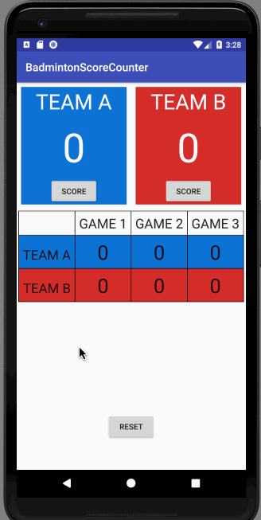
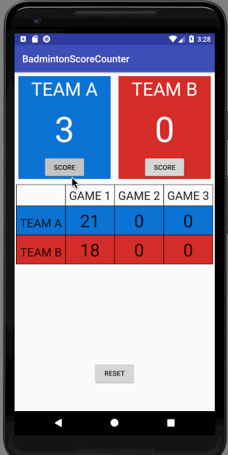
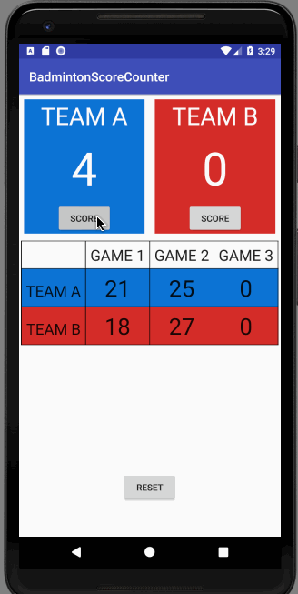

# Badminton Score Counter

> A single-screen app that counts badminton scores.

> A saver reset button is necessary.

## First thing first - Rules of Badminton
> A match consists of the best of 3 games of 21 points.

> Every time there is a serve – there is a point scored.

> The side winning a rally adds a point to its score.

> At 20 all, the side which gains a 2 point lead first, wins that game.

> If both team are in 20 points. there will be a longer game.

> At 29 all, the side scoring the 30th point, wins that game.

> The side winning a game serves first in the next game.

## Getting Started

* You can *[clone](https://github.com/arrickx/BadmintonScoreCounter.git)* or *[download](https://github.com/arrickx/BadmintonScoreCounter.git)* this project via [GitHub](https://github.com) to your local machine.
* Download and Install *[Android Studio](https://developer.android.com/studio/index.html)*

### How to use

* Open existing Android Studio Project
* Use Android Studio emulators to run this app
* (Or use your Android phone to run this app via Android Studio)

## License

* This project is licensed under the MIT License - see the [LICENSE](LICENSE) file for details.

## Acknowledgments

* **Winner Cup Image** was provided by [FREEPIK](https://image.freepik.com/free-vector/hand-holding-winner-cup_23-2147504768.jpg).
